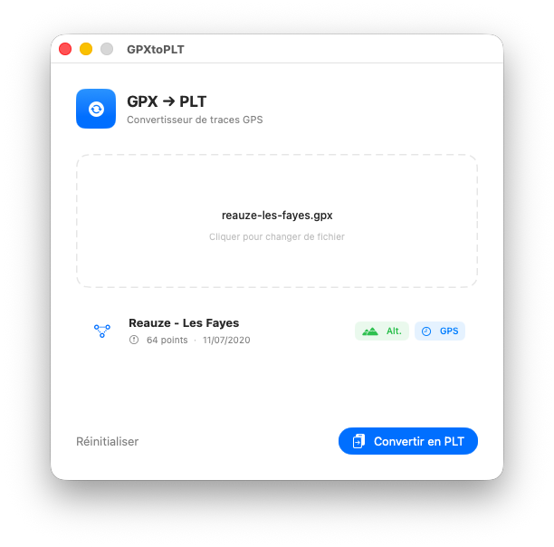

# GPX -> PLT

Simple and fast macOS converter for turning `.gpx` GPS tracks into OziExplorer-compatible `.plt` files.



## Why this app?

Got a GPX track and your mapping software is waiting for a PLT file? **GPX -> PLT** does exactly that: nothing more, nothing less.

Drop a file into the window, review the track details, then export. Conversion happens locally on your Mac: your GPS data never leaves your machine.

## Features

- **Drag and drop**: drop a `.gpx` file directly onto the app, or select it with the file picker.
- **Accurate conversion**: WGS 84 coordinates, altitude converted to feet, and dates written as Delphi `TDateTime` values.
- **Instant export**: choose the destination folder and `.plt` filename, then save.
- **Native interface**: compact macOS SwiftUI app focused on one clear action.
- **Multilingual**: interface available in French, English, Spanish, and German.

## Usage

1. Open **GPX -> PLT**.
2. Drop a `.gpx` file into the import area, or click to select one.
3. Review the track name, point count, and recording date range.
4. Click **Convert to PLT**.
5. Choose where to save the output file.

## Supported formats

### GPX

The **GPS Exchange Format** is an open XML format produced by most GPS devices, sports watches, and mobile apps such as Garmin, Strava, or Komoot. It stores WGS 84 coordinates, elevation in meters, and ISO 8601 timestamps.

### PLT

The **OziExplorer Track File** is a plain-text format used by OziExplorer and some embedded mapping applications. It encodes WGS 84 coordinates, altitude in feet, and dates as Delphi `TDateTime` values, meaning a number of days since 30 December 1899.

## Requirements

- macOS 13 or later
- Mac Apple Silicon
- Xcode to build the project from source

## Development

This project is a macOS SwiftUI app.

```sh
open GPXtoPLT.xcodeproj
```

Main files:

- `GPXtoPLT/ContentView.swift`: main interface, import, and export.
- `GPXtoPLT/GPXParser.swift`: GPX track parsing.
- `GPXtoPLT/PLTConverter.swift`: PLT content generation.
- `GPXtoPLT/AppStrings.swift`: localized interface strings.
- `Web/`: landing page and distribution archive.

## License

This project is distributed under the MIT license. See [LICENSE](LICENSE) for more information.
